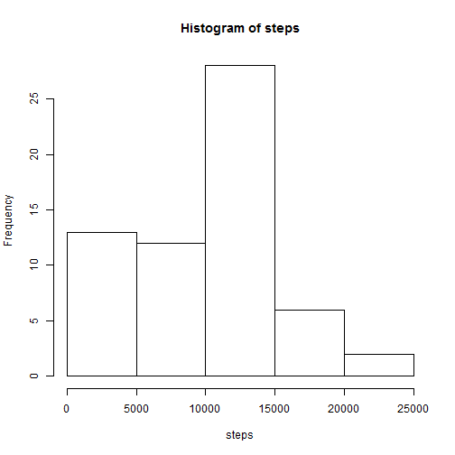
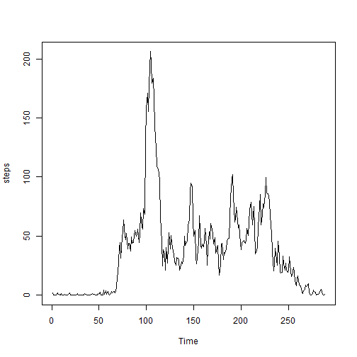
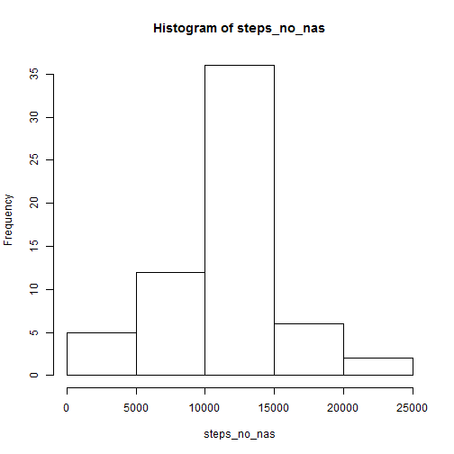
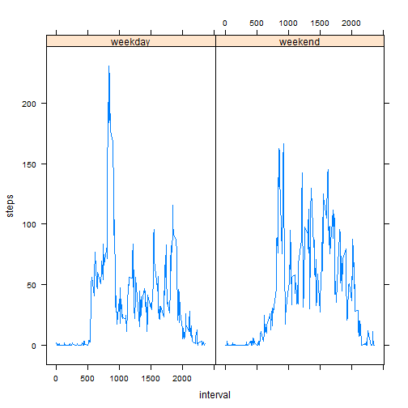

## Loading and preprocessing the data

First, we unzip and load the data:


```r
data <- read.csv(unzip("activity.zip"), na.strings="NA")
```
## What is mean total number of steps taken per day?

Based on the loaded data, we calculate the number of steps per day and make a histogram showing the frequency of steps per day intervals:


```r
library(dplyr)
by_date <- group_by(data, date)
steps_by_date <- summarise(by_date, steps = sum(steps, na.rm=T))
steps <- steps_by_date$steps
hist(steps)
```

 

```r
mean_steps <- round(mean(steps_by_date$steps))
median_steps <- median(steps_by_date$steps)
```

The mean number of steps per day is 9354; the median number is 10395.


## What is the average daily activity pattern?

We next plot the mean number of steps per 5 minute time interval:

```r
steps_by_interval <- summarise(group_by(data, interval), steps=mean(steps, na.rm=T))
steps <- steps_by_interval$steps
ts.plot(steps)
```

 


```r
max_interval <- which.max(steps)
```

The interval in which the number of steps on average is largest is interval 104.

## Imputing missing values


```r
number_of_nas <- sum(is.na(data$steps))
```

There are 2304 NAs in the dataset. We next replace NAs with the mean number of steps in the interval of the NA:

```r
mean_steps_by_interval <- summarise(group_by(data, interval), 
                                    steps=round(mean(steps, na.rm = T)))

data_no_nas <- data.frame(data)
for (i in 1:length(data$steps)) { 
        if (is.na(data[i,"steps"])) {
                data_no_nas[i, "steps"] <- mean_steps_by_interval[
                        which(mean_steps_by_interval$interval
                              ==data_no_nas[i, "interval"]),]$steps
        }
}
```

Finally, we create a histogram of steps taken each day for the modified dataset and calculate the mean and median of the total number of steps.


```r
steps_by_date_no_nas <- summarise(group_by(data_no_nas, date), steps = sum(steps, na.rm=T))
steps_no_nas <- steps_by_date_no_nas$steps
hist(steps_no_nas)
```

 

```r
mean_steps_no_nas <- round(mean(steps_by_date_no_nas$steps))
median_steps_no_nas <- median(steps_by_date_no_nas$steps)
```

The mean of daily steps for the modified data is 1.0766 &times; 10<sup>4</sup> (was 9354); the median is 1.0762 &times; 10<sup>4</sup> (was 10395). The mean and median are much closer than previously, which is also witnessed by the more symmetric histogram.

## Are there differences in activity patterns between weekdays and weekends?

We first add a column to the data that has NAs removed indicating whether a day is a weekday or a weekend day:

```r
Sys.setlocale("LC_ALL","English")
```

```
## [1] "LC_COLLATE=English_United States.1252;LC_CTYPE=English_United States.1252;LC_MONETARY=English_United States.1252;LC_NUMERIC=C;LC_TIME=English_United States.1252"
```

```r
day_of_week <- weekdays(as.Date(data_no_nas$date))
for (i in 1:length(data_no_nas$date)) { 
        if (day_of_week[i] == "Saturday" || day_of_week[i] == "Sunday") {
                data_no_nas$weekday[i] = "weekend"
        } else {
                data_no_nas$weekday[i] = "weekday"
        }
}
```

We finally use this to create a lattice plot showing differences in activity patterns (average steps per interval over days) for weekdays and weekends:


```r
library(lattice)
steps_by_weekday <- summarise(
        group_by(data_no_nas
                 , interval, weekday), 
        steps=mean(steps))
interval <- steps_by_weekday$interval
steps <- steps_by_weekday$steps
xyplot(steps~interval|
               steps_by_weekday$weekday, type="l")
```

 


